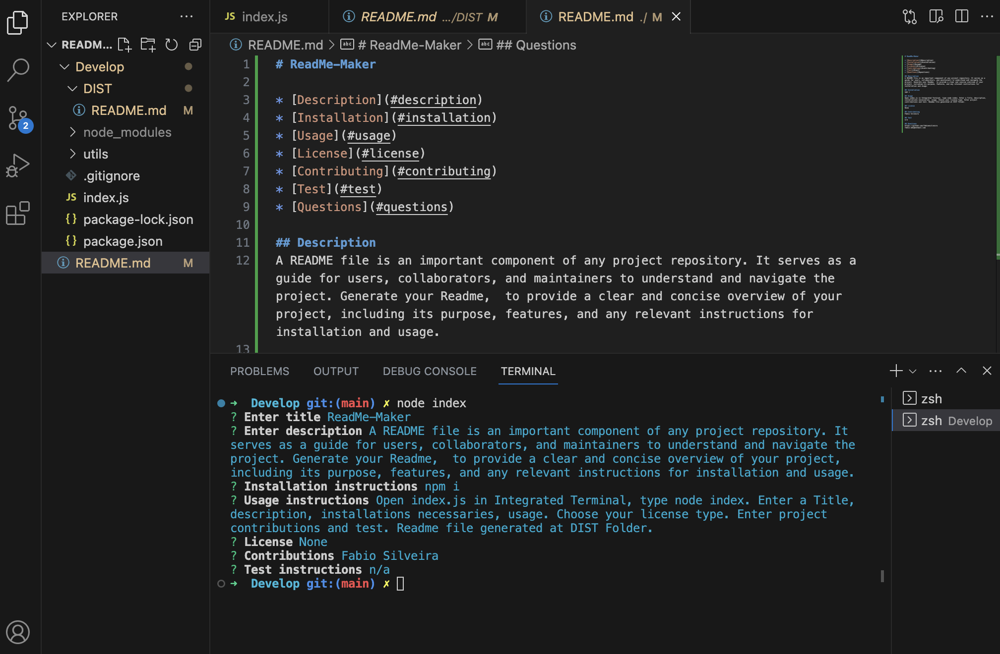

# ReadMe-Maker

* [Description](#description)
* [Installation](#installation)
* [Usage](#usage)
* [License](#license)
* [Contributing](#contributing)
* [Test](#test)
* [Questions](#questions)

## Description
A README file is an important component of any project repository. It serves as a guide for users, collaborators, and maintainers to understand and navigate the project. Generate your Readme,  to provide a clear and concise overview of your project, including its purpose, features, and any relevant instructions for installation and usage.

## Installation
npm i

## Usage
Open index.js in Integrated Terminal, type node index. Enter a Title, description, installations necessaries, usage. Choose your license type. Enter project contributions and test. Readme file generated at DIST Folder.

## License
None

## Contributing
Fabio Silveira

## Test
n/a

## Questions
https://github.com/fabioesilveira
fabio.eds@hotmail.com

## Reference

[Walkthrough Video Demo Link](https://drive.google.com/file/d/1KHpT590B7HT1eV_7LsW7DRDvrfgaj7Rb/view)

